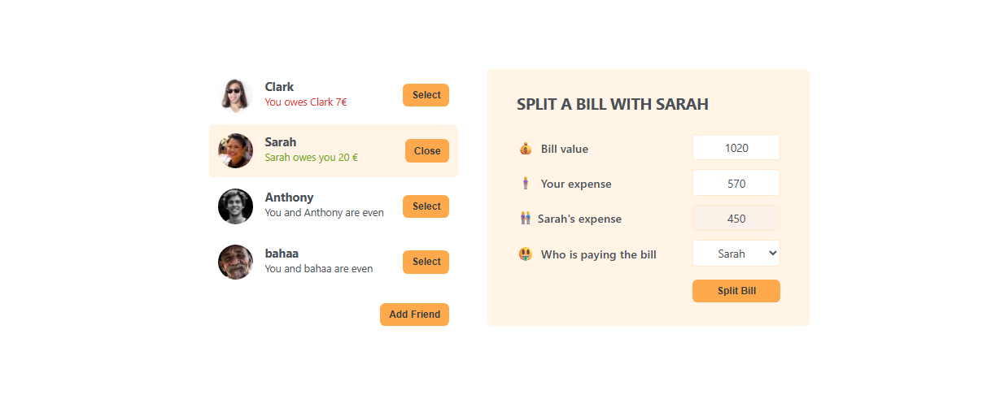

# 💸 Eat-'N-Split

A simple and interactive bill splitting app built with **React** that helps you manage shared expenses with friends.

---

## 🚀 Live Demo

👉 [View Live Demo](https://your-demo-link.vercel.app)

---

## 📸 Preview



---

## ✨ Features

- 👥 Add new friends
- 📋 View friends list with balances
- 💰 Split bills easily
- ⚖️ Track who owes who
- 🔄 Dynamic balance updates
- 🎯 Select and manage a specific friend

---

## 🛠️ Tech Stack

- React (useState)
- JavaScript (ES6+)
- CSS

---

## 📂 Project Structure

```bash
src/
│── App.js
│── components/
│   │── FriendList.js
│   │── Friend.js
│   │── FormAddFriend.js
│   │── FormSplitBill.js
│   │── Button.js
│   │── Input.js
```

---

## ⚙️ How It Works

- Each friend has:

```js
{
  (id, name, image, balance);
}
```

- Balance logic:
  - Positive → Friend owes you
  - Negative → You owe friend
  - Zero → Even

- Core logic handled in:
  - `handleAddNewFriend`
  - `handleSplitBill`
  - `handleSelection`

---

## 👨‍💻 Author

[](https://github.com/BahaaMedhat1)

[](https://www.linkedin.com/in/bahaa-wanas)

---
